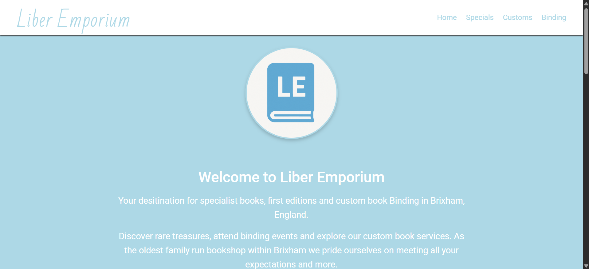

# liber-emporium
Liber Emporium, is a project for a book-store that I have decided to work on. I have chosen this project because when narrowing down what I would like to work on, I decided to focus on a website that I would be passionate about and as I have always had a passion for books and reading, it was only natural that I wanted to challenge myself by creating a book-store website with multiple pages and aspects. The website is to be tailored to any book enthusiasts who are in the local area. Ensuring that the website would be attractive and appealing to the user while ensuring the key business goal (Increase the revenue and brand awareness for the business by improving customer engagement, experience and satisfaction through a clean and appealing website that meets users needs and leads to new engagement and loyal customers.) was met, was my main objective and focus.

I wanted the project to be something I could apply to my realworld life and thus motivate me even more and to build something I could genuinely be proud of, furthering my determination and outlook on this project.

## User stories

As a book enthusiast in the local area, I want:
1. "I want to be able to find a local book store and see if what they sell suits my needs and interests"
2. "I want to be able to find a specialist book store, who provide special editions such as first editions"
3. "I want to be able to book a family workshop at a book store than does sessions on book-binding"
4. "I want to be able to order customised books for friends and family, specifically, customised book sleeves for either birthdays or special events"
5. "As a customer I would like to see a preview of the products you sell easily, maybe a section on the home page that has images of the products which when clicked, takes you to directly ordering them"
6. "I want to be able to contact the store easily"

These user stories, allowed me to design and plan my website and wireframes with the target audience and users in mind and led to a lot of the choices I made. One user story, however, that I struggled to implement, was number 5, yet this was due to my experience and knowledge level in working with Bootstrap.

## Design

When choosing my design ideas, I used the above user stories to create my wireframes and what I wanted the site to look like. Below, you can see images of my rough sketches of my wireframes. However, you may notice, that as my website began to take shape, I had to move away from some of the design choices and color schemes as they were not user friendly.

Here you can see my early wireframes: 

As you can see, the colour ways did not look good together and the overall layout of my website changed. One key example is having a map in the footer, which I came to realise was not realistic for someone at my level.

## Features

- ### Home page
The home page is the first things the customer sees, and I wanted it to be attractive and appealing, include a logo and informative sections. Here we can see the homr page on opening up the website:

Here is the informative carousel providing the user a preview, this ties directly with user story 1 and 5:

Here is the informative section with styling to draw the users eye, again (all user stories):

Here is the location and contact us section, which aids the user in finding or contacting the shop and also provides form (user story 1 and 6):

- ### Navbar

The navbar is available on all pages and provides a clean and simply way for the user to access any of the site. This is the same for any screen size, however, for mobile it becomes a hamburger menu for easier access (all user stories):

- ### Footer

A simple footer with custom social media links that open in a new tab:

- ### Additional pages photo and information section

On each additional page, there is a text and image section which provides the user with an example of what they can either purchase or recieve as a service and text explaining the different options to the user (user stories 2,3 and 4):

- ### Contact form for enquiring about any product or service offered on each page

On each page there is also a form for contacting the store or enquiring about the products or services on offer(user stories 4 and 6):

- ### Confirmation of form submitted page

Whenever any form is submitted on the website, the user is taken to a confirmation page which also goes directly back to the home page(all user stories):

## Technology used

The technology used for this project are the following:
- HTML5
- CSS3
- Bootstrap v5.3
- Fontawesome
- Google maps.
- For selecting colours, I utilised the options available to me on VScode to go between hex, rgb etc.

## Testing

In regards to testing, I have run the code through numerous screen sizes using the google inspection element and adjusted the code accordingly used media queries which has led to a consistently attractive website accross all sizes, that has no issues.

The reason I believe the code has no issues, is because I fixed the only two issues to arise when I first ran it through the validator, which was, I had included "Width: 100%" in my HTML for my embedded map, when I should of had this in my CSS. This was flagged by the validator stating it did not expect "%" after the figure. This was easily corrected. The second was a stray "</section>" tag on line 55 of my code, which was removed. I then ran all of my code through the appropriate validators again and recieved confirmation that there are no issues.

### HTML:

No issues were found while running the code through the [official W3C validator.](https://validator.w3.org/)

### CSS:

No issues were found while running the code through the [official Jigsaw validator](https://jigsaw.w3.org/css-validator/)

## Bugs

Although there were not many bugs I could not resolve due to this being a simple site, one which did cause me issues, was attempting to get the "Location" and "Contact" sections to align with eachother. The main reason I struggled to resolve this, was due to not being greatly experienced with Bootstrap, however, after some much needed research, I was able to find the correct outcome, which was simply using position:relative after my previous use of position:absolute, I also did not include a Z-index and thus when commiting both these changes, my biggest bug was fixed. The reason this took me so long, was due to trial and error with different ways to get the sections to line up, which when I finally got, it then covered my titles. This has now all been fixed.

## Deployment

I deployed my site through Github pages and I did so using the following steps:
1. In the Github repository, navigate to the Settings tab.
2. Select Pages.
3. Select deploy from a branch and choose main.
4. Save.
5. The website is then deployed.

To run the website locally, in an environment such as Gitpod:
1. Clone the repository from Github.
2. Navigate to the Project Directory.
3. Check the repository contents to ensure the clone was successful.
4. Install a simply HTTP server.
5. Start the server.
6. Access the website.

Live access to the site is available at:
[https://llpw-build.github.io/liber-emporium/index.html]

## Credits

### Content:
- I did not use any sources for any of my text as it was an entirely made up fictional shop, so all text was created by me.
- I followed some of the earlier sessions videos while starting to design my wesbite, mainly just for the boilerplate of a website (header/main/footer), however, I did not directly copy any of the code as it was customised to my needs. I have highlighted these sections with comments as requested.

### Logos:
- Any logos came from [Fontawesome](https://fontawesome.com/v4/icons/)

### Maps:
- All maps provided by Google.

### Fonts:
- All fonts provided by [Google.](fonts.google.com).

### Images:
- All images were created by myself for the purpose of this project using [ChatGPT](chatgpt.com).
